# Setting up Open Discord Bridge on AleForge

This guide walks you through connecting your Factorio server's in-game chat and events to a Discord channel using **Open Discord Bridge (ODB)**, hosted on **AleForge**. When you're done, chat and events will flow **both ways** — in-game messages appear in Discord, and Discord messages appear in-game.

It's written for regular Factorio players. You don't need any coding or Discord-developer experience — every screen you'll touch is pictured below.

**Roughly 10–15 minutes.** You'll set up a Discord bot, paste a few values into your AleForge panel, and reinstall the server once to pull in the bridge.

---

## What you'll end up with

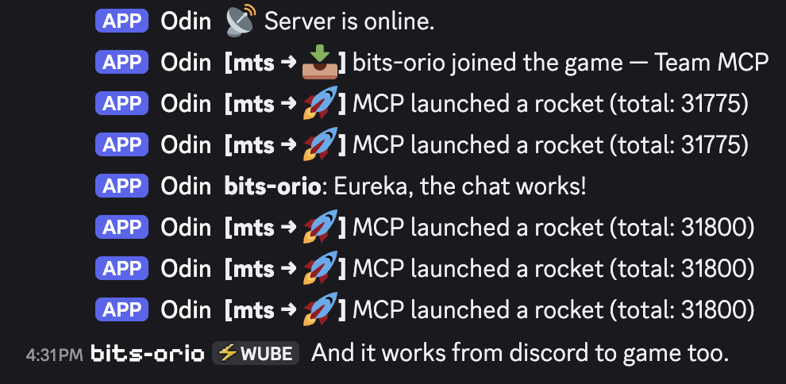

In-game chat, join/leave messages, and events (including mod events like Multi-Team Support) posting into your Discord channel — and Discord messages relayed back into the game.

---

## Before you start

You'll need:

- A **Factorio server on AleForge** that you can start, stop, and edit startup settings for.
- A **Discord server you manage** (you need the *Manage Server* permission to add a bot to it).
- About 10–15 minutes.

> ### 🔒 One security note, read this first
> During setup Discord gives you a **bot token** — a secret password for your bot. Treat it like a password:
> - **Never** post it publicly, commit it to git, or leave it visible in a screenshot you share.
> - If it ever leaks, open the bot's page and click **Reset Token** to invalidate the old one.
>
> Every screenshot in this guide that would show the token has it blacked out — do the same with yours.

---

## Step 1 — Add the ODB mod to your server

The companion mod is the piece that runs *inside* Factorio and records everything the bridge sends to Discord. It has to live on the **server**, not just your local game.

Add the latest **`open-discord-bridge`** mod through your AleForge panel — either the panel's mod manager, or by uploading the mod's `.zip` (from the [mod portal](https://mods.factorio.com/mod/open-discord-bridge)) into the server's `mods/` folder in the **File Manager**.

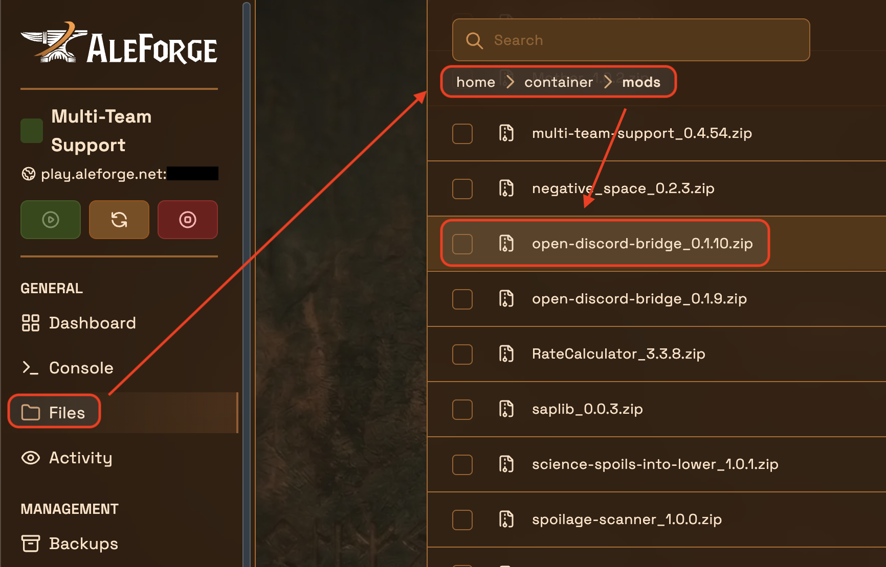

That's the only mod required. (If you also run mods like Multi-Team Support, their events will flow through the bridge automatically — no extra setup.)

---

## Step 2 — Create a Discord application (your bot)

1. Go to the **Discord Developer Portal**: <https://discord.com/developers/applications> and log in with the account that should own the bot.
2. Click **New Application** (top-right).

   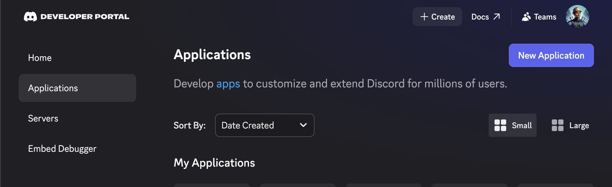

3. Give it a name — this becomes your bot's default name in Discord, so pick something like `YourServer Bridge` (here it's **Odin**). Accept the terms and click **Create**.

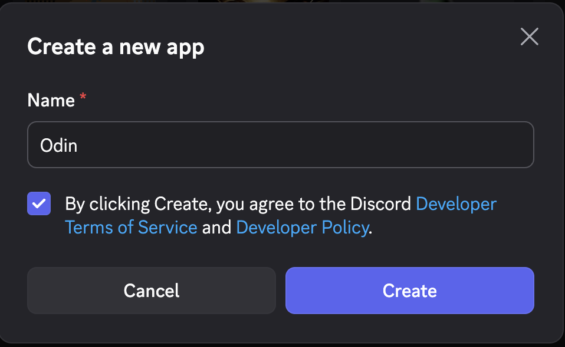

Once created, open the **Bot** tab in the left sidebar. For new applications the bot user already exists. Here you can optionally set the bot's **username** and **avatar** — this is the name and icon players will see posting events in Discord.

---

## Step 3 — Get the bot token

Still on the **Bot** tab, find the **Token** section and click **Reset Token** (then confirm). Discord shows the token **once** — copy it now and keep it somewhere safe for Step 7. If you lose it, just reset again.

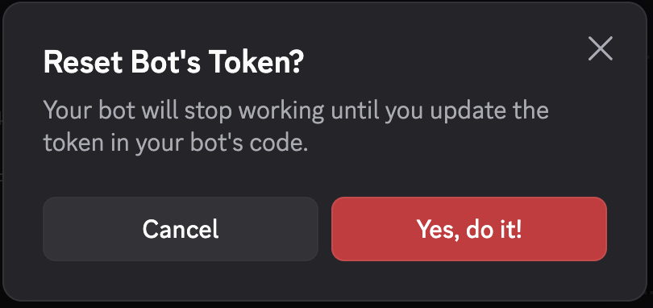

After resetting, the token appears with a **Copy** button. Copy it. (Shown here blacked out — never share yours.)

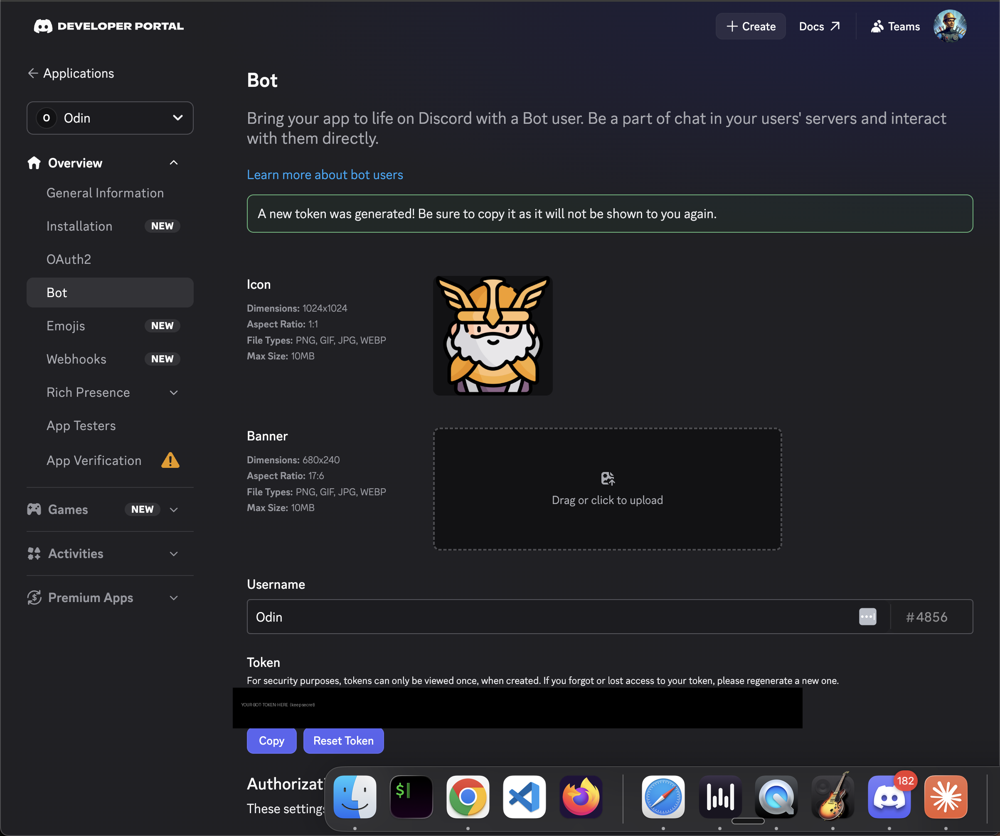

---

## Step 4 — Enable the Message Content Intent

**This is the step people miss, and skipping it breaks half the bridge.**

On the **Bot** tab, scroll down to **Privileged Gateway Intents** and turn **ON** → **Message Content Intent**, then **Save Changes**.

Without it, the bot can't read messages in your channel, so **Discord → game** relay silently won't work (game → Discord still would, which makes it confusing to debug). Leave **Presence Intent** and **Server Members Intent** off — ODB doesn't need them.

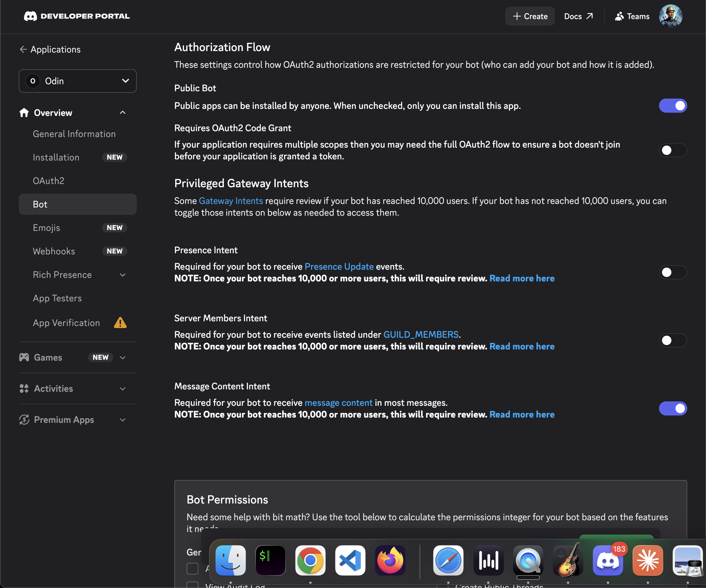

---

## Step 5 — Invite the bot to your server

### 5a. Choose the bot's scope

In the left sidebar open **OAuth2** → scroll to the **OAuth2 URL Generator**. Under **Scopes**, tick **`bot`**. (You can also tick **`applications.commands`** if you'd like slash commands like `/players` later — it's harmless to include.)

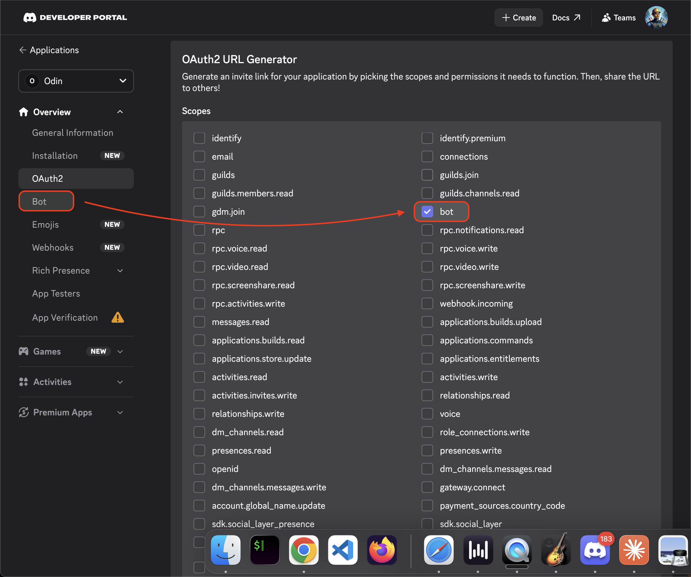

### 5b. Choose its permissions

A **Bot Permissions** box appears below. Tick exactly these three — that's all the chat bridge needs:

- **View Channels**
- **Send Messages**
- **Read Message History**

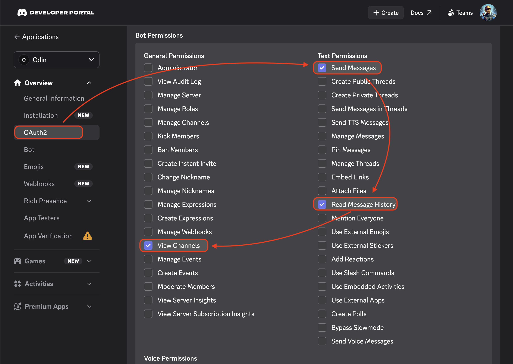

### 5c. Copy the generated invite link

At the very bottom, copy the **Generated URL**. (This link is safe to share — it contains only your public app ID and the permissions, no secret.)

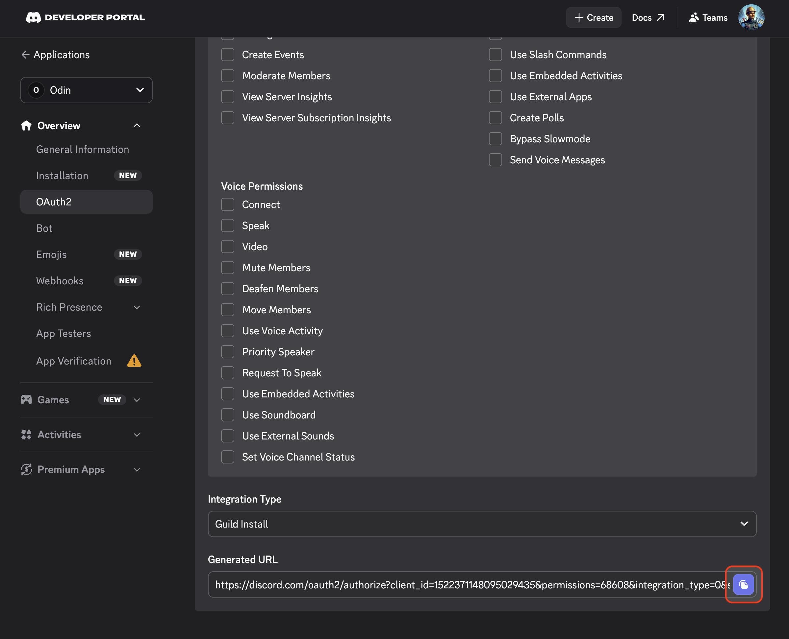

### 5d. Authorize the bot

Paste the URL into your browser, pick your server from the **Add to server** dropdown, click **Authorize**, and complete the captcha.

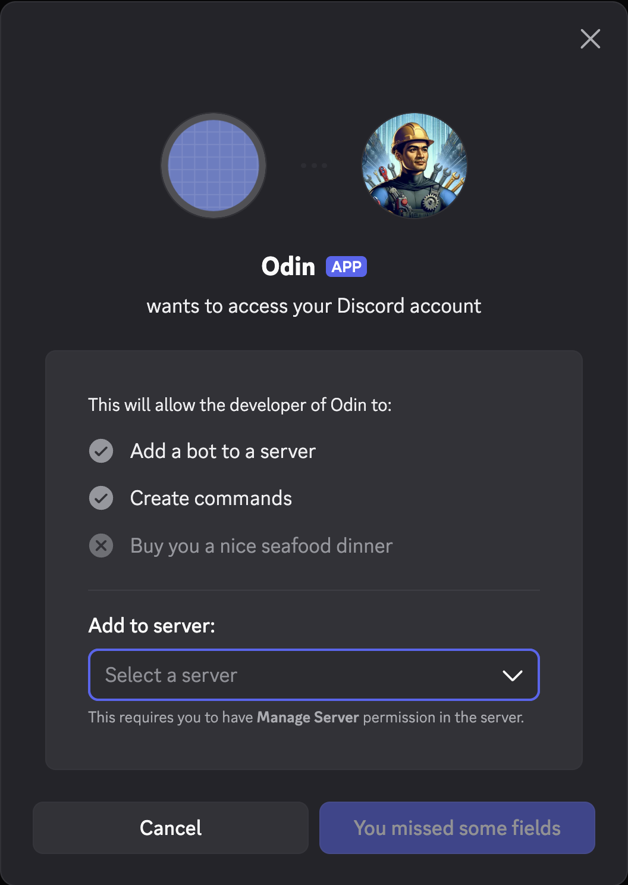

You'll see the bot join your server:

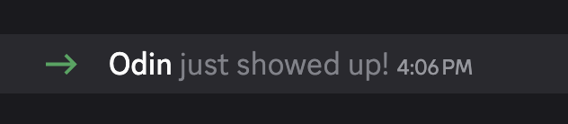

---

## Step 6 — Create the channel and copy its ID

### 6a. Create the channel

Make (or pick) a text channel for the bridge — e.g. **#server-chat**. Keep **Private Channel** off for the simplest setup; if you do make it private, remember to add the bot (or its role) to the channel so it can see and post.

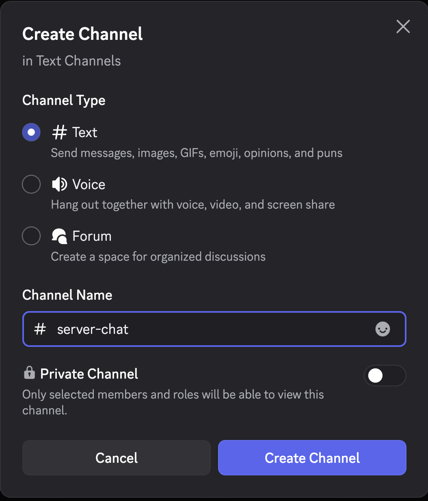

### 6b. Turn on Developer Mode

You need Discord's Developer Mode once, so you can copy IDs. Go to **User Settings → Advanced → Developer Mode → ON**.

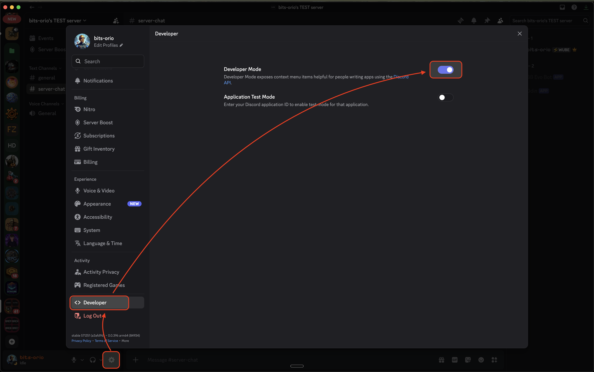

### 6c. Copy the channel ID

Right-click your **#server-chat** channel → **Copy Channel ID**. Save that number for the next step.

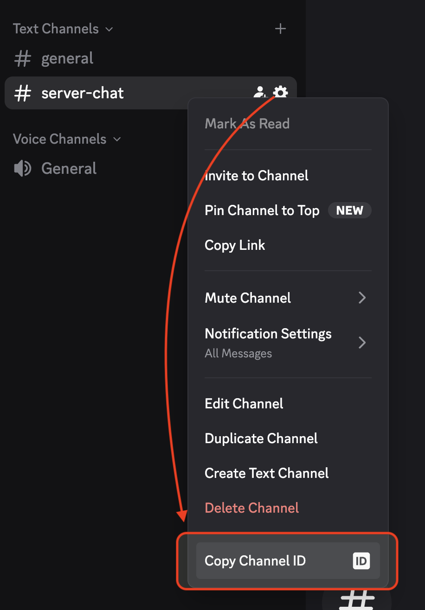

---

## Step 7 — Fill in the AleForge startup panel

In your AleForge panel, open the **Startup** settings and fill in:

| Field | What to enter |
|---|---|
| **RCON Port** | Leave the default unless you have a reason to change it. |
| **RCON Password** | Set a strong password. **Required** — if blank, RCON is off and Discord → game won't work. |
| **Enable Discord Bridge** | Toggle **ON**. |
| **Discord Bot Token** | Paste the token from Step 3. |
| **Discord Channel ID** | Paste the channel ID from Step 6c. |
| **Discord Linked Role ID** | Leave **blank** (optional — see *Advanced* below). |

Then save the startup settings.

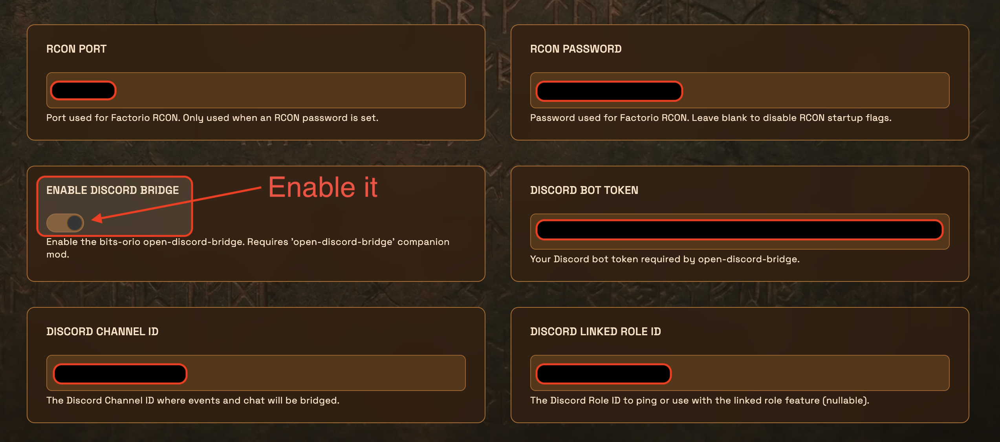

> Double-check the **Enable Discord Bridge** toggle is actually on before you continue.

---

## Step 8 — Reinstall the server to pull the bridge

AleForge installs the bridge for you via a reinstall, which fetches the latest version and wires up the values you just saved.

1. **Stop** the server and wait until it's fully **Offline**.

   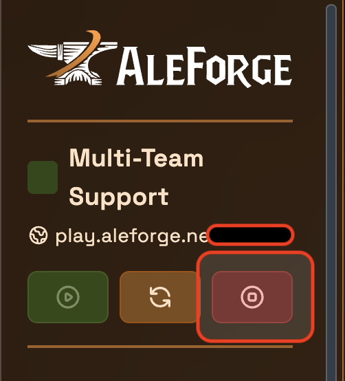

2. Go to **Settings → Reinstall Server** and confirm.

   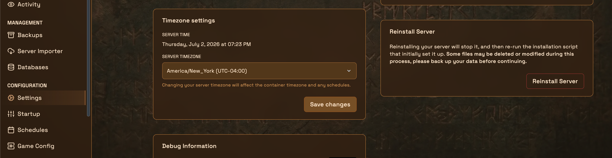

   > ⚠️ Reinstalling re-runs the install script. Your saves and mods are preserved, but AleForge warns that some files may change — it's good practice to take a **Backup** first.

3. Wait for the reinstall to finish, then **Start** the server.

---

## Step 9 — Verify it works

Test **both directions**:

**Game → Discord:** join the server (or use the panel **Console**) and send an in-game chat message. Within a second or two it should appear in **#server-chat**, along with join/leave and event messages.

**Discord → Game:** type a message in **#server-chat**. It should appear in-game as `[Discord] yourname: message`.

![A Discord message appearing in-game with a [Discord] prefix](images/19-verify-discord-to-game.png)

If you got messages both ways — you're done. 🎉

---

## Troubleshooting

**Game → Discord works, but Discord → game doesn't.**
Almost always one of two things: the **Message Content Intent** is off (Step 4), or the **RCON Password / Port** don't match. Fix and restart.

**Nothing appears in Discord at all.**
Check that: the **Enable Discord Bridge** toggle is on, the **Channel ID** is correct, the bot is actually **in that channel**, and the bot has **View Channels / Send Messages** there (a private channel needs the bot added explicitly).

**Still stuck?**
On every startup the bridge writes a `bridge.effective.yaml` file in its working directory. It shows the config it actually resolved, whether each secret is `SET` or `MISSING` (names only, never values), and any warnings. It's the first place to look. The bridge also checks its own channel permissions on connect and posts a one-off warning to the channel if something's missing.

---

## Advanced (optional) — Linked Role

ODB can give a Discord **role** to players who link their Factorio and Discord accounts (colored name, grouped in the member list). This is optional and left blank in the steps above.

To enable it:

1. **Give the bot two more permissions:** **Manage Roles** and **Manage Nicknames**. Re-run the invite (Step 5) with those ticked, or edit the bot's role in **Server Settings → Roles**.
2. **Fix the role hierarchy:** in **Server Settings → Roles**, drag the **bot's own role above** the role it will assign. A bot can only manage roles *below* its highest role.
3. **Copy the role ID:** with Developer Mode on, right-click the linked role in **Server Settings → Roles → ⋯ → Copy Role ID**.
4. Paste it into the **Discord Linked Role ID** field in the AleForge startup panel, then reinstall/restart.

Players link in-game by running `/odb-link` to get a code, then running your link command in Discord.

---

## Reference — what the panel fields map to

Under the hood, AleForge passes your startup fields to the bridge as environment variables:

| AleForge field | Bridge variable |
|---|---|
| RCON Port + RCON Password | `ODB_RCON_ADDRESS` (`127.0.0.1:<port>`) + `FACTORIO_RCON_PASSWORD` |
| Discord Bot Token | `DISCORD_BOT_TOKEN` |
| Discord Channel ID | `ODB_DISCORD_CHANNEL_ID` |
| Discord Linked Role ID | `ODB_LINKED_ROLE_ID` |

Full deployment reference: <https://github.com/bits-orio/open-discord-bridge>
